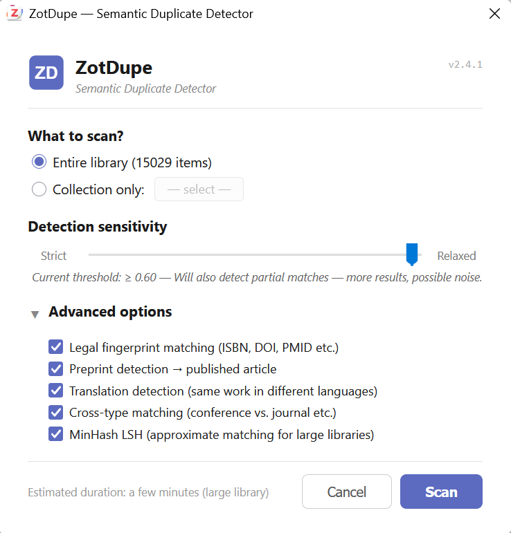

# ZotDupe

ZotDupe finds duplicate Zotero items that exact matching often misses, including preprints and published articles, translations, records with different item types, and incomplete metadata.



## How detection works

- Compares DOI, ISBN, PMID, PMCID, URL, and legal-document fingerprints.
- Normalizes titles, dates, and creators before comparison.
- Uses title, author, preprint, translation, and cross-type signals.
- Uses MinHash LSH to narrow candidate pairs in large libraries.
- Scans the whole library or a selected collection.
- Offers strict, balanced, and relaxed sensitivity levels.

## Reviewing duplicates

ZotDupe groups likely duplicates for review. You choose the master item before merging, and the preview shows which fields, tags, collections, notes, and attachments will be kept. Review each group before confirming a merge.

## Installation

1. Download the latest `.xpi` from [Releases](https://github.com/sorinhostiuc/zotdupe/releases/latest).
2. In Zotero, open **Tools > Plugins**.
3. Choose **Install Plugin From File**, select the `.xpi`, and restart Zotero if asked.

ZotDupe supports Zotero 7 through 9.

## Development

The add-on source is in `zotdupe/`.

```bash
for test in zotdupe/tests/test-*.js; do node "$test"; done
bash zotdupe/build.sh
```

## License

[MIT](LICENSE)
